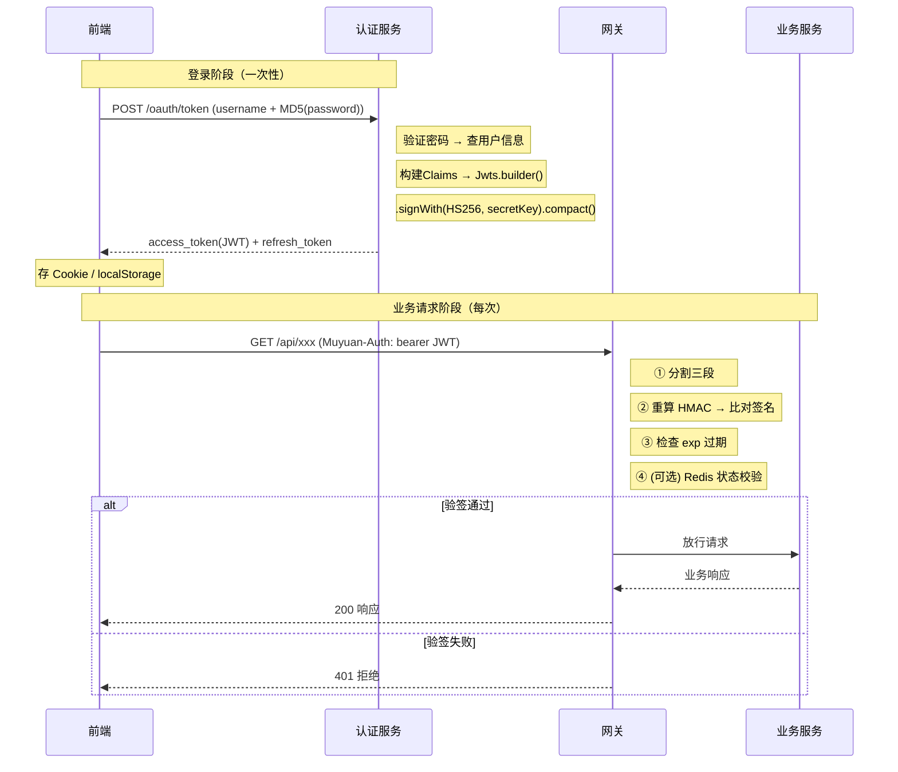

# JWT 鉴权学习梳理

> 本文梳理 JWT 无状态鉴权的核心原理：从 token 结构、生成、传输到验签的完整链路，以及 Base64Url 编码和 HMAC-SHA256 签名的输入输出。适合理解 HTTP 鉴权基础、想掌握 JWT 原理的读者。

## 1. 一句话定位

JWT 用一个自包含的签名字符串替代每次查库验证密码——密码只在登录时用一次，之后靠密钥签名信任 token，无需再查数据库即可确认身份。

## 2. 整体地图

下图回答：从用户登录到业务请求成功，各组件按什么顺序交互？



图未展开验证码校验、refresh_token 刷新和服务间 SSO 等辅助流程，这些在后文按需补充。

## 3. 核心知识

### 3.1 JWT 三段结构

JWT 是一个用 `.` 分隔的三段式字符串：

```text
eyJhbGciOiJIUzI1NiJ9.eyJ0ZW5hbnRfaWQiOiIwMDAwMDAi...xxx.5mJ3vN3Qk...xxx
└── Header 段 ──┘└── Payload 段 ──────────────────────┘└── Signature 段 ─┘
```

| 段 | 内容 | 编码方式 | 性质 |
|----|------|----------|------|
| Header | `{"alg":"HS256","typ":"JWT"}` | Base64Url | 可逆编码 |
| Payload | 用户身份信息 + exp/iat | Base64Url | 可逆编码 |
| Signature | HMAC-SHA256 哈希结果 | Base64Url | 不可逆哈希 |

**关键区别**：Header 和 Payload 是编码（可逆），任何人都能解码看到内容；Signature 是哈希（不可逆），无法反推。JWT 的安全性靠签名保证，不是靠编码隐藏内容。

### 3.2 Base64Url 编码

- **是什么**：Base64 的 URL 安全变体，把任意二进制字节转为纯 ASCII 字符串。
- **与 Base64 的区别**：`+` → `-`，`/` → `_`，去掉末尾 `=` 填充。因为 `+` 和 `/` 在 URL 和 HTTP Header 中是特殊字符，会导致 token 被破坏。
- **输入**：一段 JSON 字符串的 UTF-8 字节序列。
- **输出**：一段只含 `[A-Za-z0-9-_]` 的 ASCII 字符串。
- **可逆**：完全可逆，可随时解码还原原始 JSON。

**具体例子（Header 段）**：

输入 JSON：`{"alg":"HS256","typ":"JWT"}`

UTF-8 字节：`7B 22 61 6C 67 22 3A 22 48 53 32 35 36 22 2C 22 74 79 70 22 3A 22 4A 57 54 22 7D`

输出（Base64Url 编码）：`eyJhbGciOiJIUzI1NiIsInR5cCI6IkpXVCJ9`

> ⚠️ Payload 是 Base64Url 编码而非加密，任何人都能解码看到内容，所以不能放密码等敏感信息。

### 3.3 HMAC-SHA256 签名

- **是什么**：用密钥对数据做 HMAC-SHA256 运算得到的固定长度哈希值。
- **输入①**：`base64UrlEncode(Header) + "." + base64UrlEncode(Payload)`（即前两段拼接后的字符串）。
- **输入②**：`secretKey`（服务端密钥，字节形式）。
- **算法**：HMAC-SHA256。
- **输出**：32 字节（256 bit）的哈希值 → 再 Base64Url 编码 → ASCII 字符串。
- **不可逆**：无法从输出反推输入，所以签名段不存在"反向解码"。

**具体计算过程**：

```text
待签名数据 = "eyJhbGciOiJIUzI1NiJ9" + "." + "eyJ0ZW5hbnRfaWQiOiIwMDAwMDAi..."
密钥       = secretKey.getBytes()
HMAC-SHA256(key=密钥, data=待签名数据) → 32字节哈希
→ Base64UrlEncode → "5mJ3vN3Qk..."
```

**为什么签名能防篡改**：攻击者篡改 Payload 后，需要重新计算签名，但没有 secretKey 就算不出正确签名，网关验签时比对不通过即拒绝。

### 3.4 JWT 生成

- **输入**：用户认证信息（username + password）→ 验证通过后查询出的用户身份信息（userId、tenantId、roleId 等）+ secretKey。
- **过程**：
  1. 验证用户身份（查库比对密码）。
  2. 查询用户信息，构建 Claims（键值对 Map）。
  3. 调用 JWT 库构建 token。
  4. （可选）将 token 存入 Redis 用于状态校验。
- **输出**：JWT 字符串（access_token，有效期短）+ refresh_token（有效期长）。

构建 token 的核心代码（基于 jjwt 库）：

```java
// 构建 Claims
Map<String, Object> claims = new HashMap<>();
claims.put("tenant_id", tenantId);
claims.put("user_id", userId);
claims.put("role_id", roleId);
claims.put("user_name", userName);
claims.put("exp", System.currentTimeMillis() + 3600 * 1000);

// 生成 JWT
String token = Jwts.builder()
    .setClaims(claims)                                    // 放入载荷
    .setIssuedAt(new Date())                              // 签发时间 iat
    .setExpiration(new Date(System.currentTimeMillis()    // 过期时间 exp
        + expireTime * 1000))
    .signWith(SignatureAlgorithm.HS256,                   // HMAC-SHA256 签名
              secretKey.getBytes())
    .compact();                                           // 拼接为 xxx.yyy.zzz
```

> **项目示例**：muyuan-slaughter 项目中，认证服务（muyuan-auth）独立部署，接收 `POST /oauth/token` 请求，支持 password、captcha、refresh_token、muyuansso 等多种 grant_type。JWT 工具类由外部依赖 `muyuan-starter-jwt`（SpringBlade 框架组件）提供。

### 3.5 JWT 验签

**核心原则**：验签是"重新计算签名 + 比对"，不是"反向解码签名"。

因为 HMAC-SHA256 是单向哈希函数，无法从输出反推输入。验签时用相同密钥对前两段重新计算 HMAC，再和第三段比对。

**精确步骤**：

```text
① 用 "." 分割 token → headerPart, payloadPart, signaturePart

② 拼接前两段（不解码！直接用编码后的字符串）
   data = headerPart + "." + payloadPart

③ 用密钥重新计算签名
   expectedSig = Base64UrlEncode(HMAC-SHA256(secretKey, data))

④ 比对
   expectedSig === signaturePart ?
   ├─ 不等 → 签名无效（被篡改/密钥不对）→ 401
   └─ 相等 → 验签通过

⑤ 验签通过后，解码 Payload 检查 exp
   claims = Base64UrlDecode(payloadPart) → JSON → Map
   claims.exp > 当前时间 ? → 验过期
```

> 时序很重要：先验签确认 token 没被篡改，然后才信任 Payload 里的内容。如果先读 Payload 再验签，攻击者篡改的 Payload 会被误信。

**生成与验签对照**：

| | 生成 | 验签 |
|---|------|------|
| 输入 | Claims + secretKey | JWT 字符串 + secretKey |
| 过程 | `Jwts.builder().setClaims().signWith().compact()` | 分割三段 → 重算 HMAC → 比对 |
| 输出 | JWT 字符串 | Claims（验签通过）或 null（失败） |

**类比**：签名验证就像签字比对——你不可能把签字"还原"成手，只能"再签一次，看像不像"。HMAC 同理：单向不可逆，只能重算 + 比对。

### 3.6 密码与 JWT 的关系

```text
登录时（一次性）                    后续每次请求（无数次）
─────────────                     ──────────────
密码(MD5) → 验证身份               携带 JWT → 验签+验过期
   ↓                                  ↓
验证通过 → 生成 JWT                 无需密码、无需查库
   ↓                                  ↓
JWT 不含密码，只含身份信息          即可确认"你是谁"
```

- **密码的作用**：仅限于登录时"证明你是这个人"，验证通过后不再使用。
- **JWT 的内容**：只放身份标识（userId、tenantId、roleId 等），绝不放密码。
- **无状态**：网关验签只需 secretKey，不需要查数据库验证密码，这就是 JWT "无状态"的含义。
- **局限**：JWT 一旦签发在过期前无法主动作废（除非开启 Redis 状态校验，用额外存储实现踢人/登出失效）。

## 4. 贯穿示例

以下用一个完整示例串起 JWT 的生成、传输和验签全过程。

### 4.1 登录获取 JWT

请求：

```text
POST /oauth/token
Authorization: Basic Base64(clientId:clientSecret)
Params: grant_type=password&username=admin&password=e10adc39...(MD5)
```

认证服务验证通过后生成 JWT：

```text
Header:  {"alg":"HS256","typ":"JWT"}
Payload: {"tenant_id":"000000","user_id":"123","user_name":"admin","exp":1630000000}
```

Base64Url 编码 + HMAC-SHA256 签名后：

```text
eyJhbGciOiJIUzI1NiJ9.eyJ0ZW5hbnRfaWQiOiIwMDAwMDAiLCJ1c2VyX2lkIjoiMTIzIiwidXNlcl9uYW1lIjoiYWRtaW4iLCJleHAiOjE2MzAwMDAwMDB9.5mJ3vN3Qk...
```

响应：

```json
{
  "access_token": "eyJhbGciOiJIUzI1NiJ9...",
  "refresh_token": "eyJhbGciOiJIUzI1NiJ9...",
  "expires_in": 3600,
  "tenant_id": "000000",
  "user_name": "admin"
}
```

### 4.2 携带 JWT 请求

```text
GET /api/xxx
Muyuan-Auth: bearer eyJhbGciOiJIUzI1NiJ9...
```

### 4.3 网关验签

```text
① 分割 → headerPart="eyJhbGciOiJIUzI1NiJ9"
          payloadPart="eyJ0ZW5hbnRfaWQiOiIwMDAwMDAi..."
          signaturePart="5mJ3vN3Qk..."

② 重算 → expected = Base64Url(HMAC-SHA256(secretKey, headerPart+"."+payloadPart))

③ 比对 → expected === signaturePart → 验签通过 ✅

④ 验过期 → 解码 payloadPart → exp=1630000000 > 当前时间 → 未过期 ✅

⑤ 放行 → 下游业务服务
```

## 5. 易混概念

| 概念 A | 概念 B | 核心区别 | 选择依据 |
|--------|--------|----------|----------|
| 编码（Base64Url） | 哈希（HMAC-SHA256） | 编码可逆，哈希不可逆 | 传输用编码，防篡改用哈希 |
| Base64 | Base64Url | `+/` vs `-_`，Base64Url 去 `=` | URL/Header 传输用 Base64Url |
| 编码 | 加密 | 编码不需密钥可逆，加密需密钥可逆 | 编码用于格式转换，加密用于保密 |
| 哈希 | 加密 | 哈希不可逆，加密可逆需密钥 | 防篡改用哈希，保密用加密 |
| access_token | refresh_token | access 有效期短用于鉴权，refresh 有效期长用于续期 | 请求用 access，过期后用 refresh 换新 |
| 无状态鉴权 | 有状态鉴权 | 无状态不查库（JWT），有状态每次查库（Session） | 微服务分布式用 JWT，单体内聚可用 Session |

## 6. 常见误区与边界

1. **误区**：签名可以"反向解码"出原始数据。
   **正确理解**：HMAC-SHA256 是单向哈希，不可逆。验签是"重新计算 + 比对"，不是"解码签名"。

2. **误区**：Payload 是加密的，别人看不到内容。
   **正确理解**：Payload 是 Base64Url 编码，任何人都能解码。不能放密码等敏感信息。

3. **误区**：验签时需要先解码 Header 和 Payload 再重新编码后计算签名。
   **正确理解**：验签时直接用编码后的字符串参与 HMAC 计算，不需要先解码。因为生成签名时用的也是编码后的字符串。

4. **误区**：JWT 一旦签发就无法失效。
   **正确理解**：纯 JWT 确实无法主动作废，但可通过额外的 Redis 状态校验实现踢人/登出失效。这是"无状态"与"可控失效"的权衡。

5. **误区**：密码需要放在 JWT 里以便后续验证。
   **正确理解**：密码只在登录时验证一次，JWT 只放身份标识。后续鉴权靠验签，不需要密码。

## 7. 速查

| 目标 | 概念或操作 | 关键条件 |
|------|-----------|----------|
| 防篡改 | HMAC-SHA256 签名 | 需要服务端 secretKey |
| URL 安全传输 | Base64Url 编码 | 替换 `+/` 为 `-_` |
| 验签 | 重算 HMAC + 比对第三段 | 密钥与生成端一致 |
| 防信息泄露 | Payload 不放敏感信息 | Base64Url 可解码 |
| 主动失效 | Redis 状态校验 | 需额外存储，牺牲无状态 |
| 续期 | refresh_token 换新 access_token | refresh_token 未过期 |
| 多租户 | Claims 中放 tenant_id | 认证服务写入，网关读取 |

## 8. 最终记忆主线

1. **密码一次性**：密码只在登录验证身份，JWT 不含密码，之后靠验权。
2. **三段结构**：Header（编码）+ Payload（编码）+ Signature（哈希），用 `.` 拼接。
3. **编码 vs 哈希**：Base64Url 可逆（传输），HMAC-SHA256 不可逆（防篡改）。
4. **验签 = 重算 + 比对**：不是反向解码，用相同密钥对前两段重算 HMAC，和第三段比对。
5. **先验签后读内容**：验签通过后才解码 Payload，防止信任被篡改的数据。
6. **无状态权衡**：不查库即可鉴权是优势，但无法主动作废是代价（Redis 状态校验可弥补）。

## 9. 自测问题

1. 为什么 JWT 的 Payload 不能放密码？Payload 用的是什么编码，能否被还原？
2. 验签时为什么不直接"解码签名"，而是"重新计算 + 比对"？HMAC-SHA256 的什么性质决定了这一点？
3. 验签时需要先解码 Header 和 Payload 再重新编码后参与 HMAC 计算吗？为什么？
4. 如果攻击者篡改了 Payload 中的 `user_id`，网关验签时会怎样？
5. JWT 的"无状态"鉴权是什么意思？它带来了什么优势，又有什么局限？
6. 如果需要实现"用户登出后 token 立即失效"，纯 JWT 能做到吗？需要什么额外机制？
