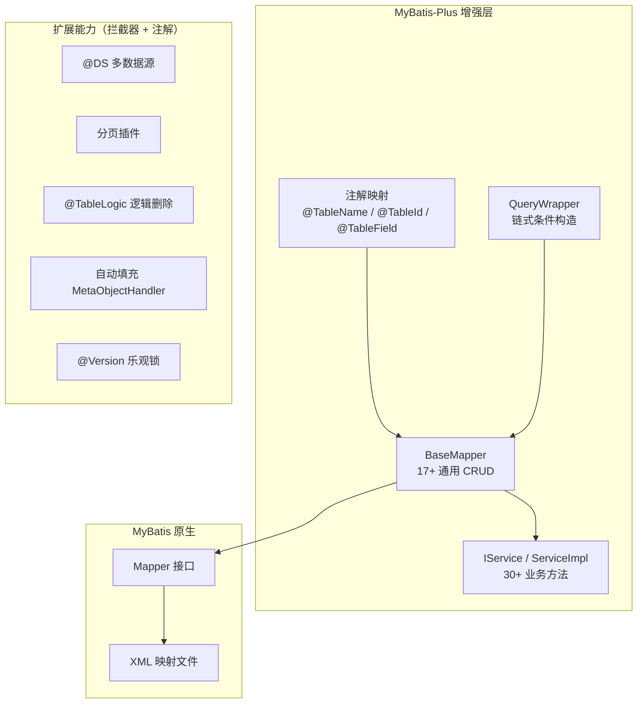
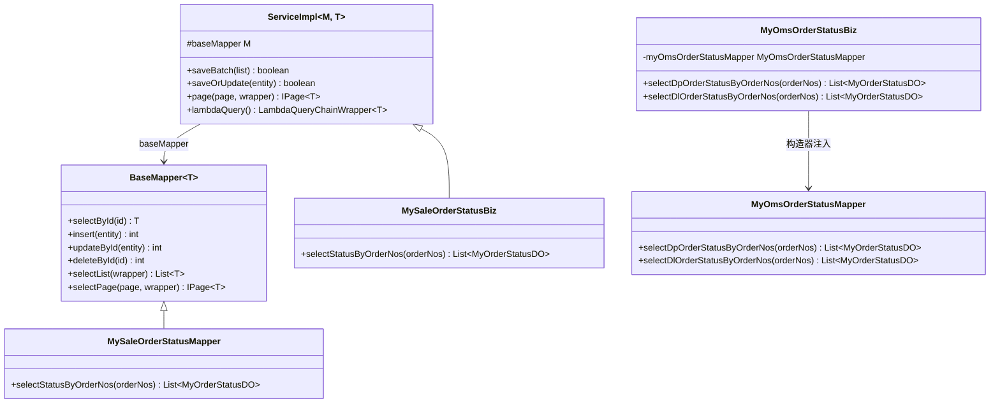
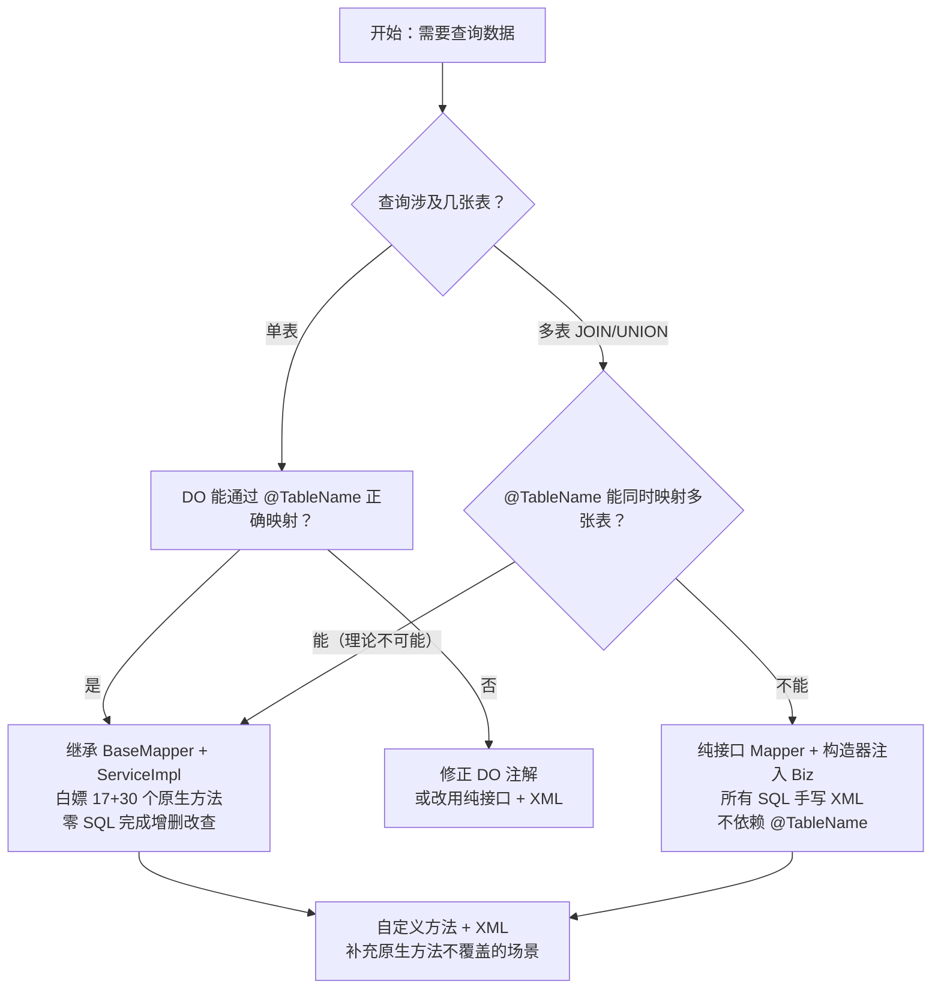

# MyBatis-Plus 学习梳理

> 本文解决：MyBatis-Plus 的核心功能是什么、各功能之间如何协作、以及单表与多表场景下如何选择继承模式。适合有 MyBatis 基础的 Java 开发者。

## 1. 一句话定位

MyBatis-Plus（简称 MP）是 MyBatis 的增强工具，核心宗旨是"只做增强不做改变"——在不破坏 MyBatis 原有能力的前提下，通过 BaseMapper、IService 和条件构造器消除单表 CRUD 的重复劳动。

## 2. 整体地图



MyBatis-Plus 在 MyBatis 之上增加了一层通用能力：BaseMapper 提供零 SQL 的单表 CRUD，IService 在其上封装批量操作和业务组合方法，条件构造器替代手写 WHERE 条件，注解完成 DO 与表的绑定。扩展能力（多数据源、分页、逻辑删除等）通过拦截器和注解实现，与核心层正交。

## 3. 核心知识

### 3.1 BaseMapper — 通用 CRUD

- **是什么**：MyBatis-Plus 提供的泛型 Mapper 接口，继承后自动获得 17 个原生 CRUD 方法，无需编写任何 XML。
- **如何工作**：MP 在启动时扫描 DO 上的 `@TableName` 和 `@TableId` 注解，构建 TableInfo，在运行时自动生成 SQL。
- **输入/输出**：输入为 DO 实体或条件构造器，输出为 DO 实体或影响行数。
- **何时使用**：单表增删改查，且 DO 能通过 `@TableName` 正确映射到一张数据库表。
- **边界**：多表 JOIN、UNION 查询不支持，需手写 XML。

```java
// Mapper 继承 BaseMapper 后，空接口已有 17 个方法
public interface MySaleOrderStatusMapper extends BaseMapper<MyOrderStatusDO> {
    // 空接口，selectById / insert / updateById / deleteById / selectList 等全部可用
}

// 使用 — 零 SQL
mapper.selectById("DP001");              // SELECT * FROM my_sale_order WHERE order_no = 'DP001'
mapper.insert(do);                        // INSERT INTO my_sale_order (order_no, status) VALUES (...)
mapper.updateById(do);                    // UPDATE my_sale_order SET status = ? WHERE order_no = ?
mapper.deleteById("DP001");              // DELETE FROM my_sale_order WHERE order_no = 'DP001'
mapper.selectList(wrapper);              // SELECT * FROM my_sale_order WHERE status = 1
```

### 3.2 IService / ServiceImpl — 业务层封装

- **是什么**：在 BaseMapper 之上再封装 30+ 个 Service 级方法，解决 BaseMapper 无法直接处理的批量操作和业务组合操作。
- **如何工作**：`ServiceImpl<M extends BaseMapper<T>, T>` 持有 `baseMapper` 字段（即 Mapper 实例），在原生 CRUD 之上叠加 saveBatch、saveOrUpdate、page 等方法。
- **何时使用**：Biz 层需要批量插入、保存或更新、链式查询或分页时。
- **边界**：Mapper 必须继承 BaseMapper，否则 ServiceImpl 无法实例化。

```java
@Service
public class MySaleOrderStatusBiz extends ServiceImpl<MySaleOrderStatusMapper, MyOrderStatusDO> {

    public void demo() {
        // 批量插入 — BaseMapper 做不到
        this.saveBatch(Arrays.asList(do1, do2, do3));

        // 保存或更新 — 自动判断主键是否存在
        this.saveOrUpdate(do);

        // 链式 Lambda 查询 — 类型安全
        List<MyOrderStatusDO> list = this.lambdaQuery()
                .eq(MyOrderStatusDO::getOrderStatus, 1)
                .like(MyOrderStatusDO::getOrderNo, "DP")
                .list();

        // 分页 — 一行搞定
        IPage<MyOrderStatusDO> page = this.page(
            new Page<>(1, 10),
            new QueryWrapper<MyOrderStatusDO>().eq("status", 1)
        );
    }
}
```

### 3.3 条件构造器 — QueryWrapper / LambdaQueryWrapper

- **是什么**：替代手写 SQL WHERE 条件的 Java API，支持链式调用。
- **区别**：`QueryWrapper` 使用字符串列名，`LambdaQueryWrapper` 使用方法引用（编译期类型安全）。

```java
// QueryWrapper — 字符串列名
QueryWrapper<MyOrderStatusDO> wrapper = new QueryWrapper<>();
wrapper.eq("status", 1)
       .like("order_no", "DP")
       .ge("create_time", "2026-01-01")
       .orderByDesc("create_time")
       .last("LIMIT 10");

// LambdaQueryWrapper — 类型安全，重构时列名自动跟随
LambdaQueryWrapper<MyOrderStatusDO> lambda = new LambdaQueryWrapper<>();
lambda.eq(MyOrderStatusDO::getOrderStatus, 1)
      .like(MyOrderStatusDO::getOrderNo, "DP");
```

| 方法 | 对应 SQL |
|------|---------|
| `eq` / `ne` | `=` / `<>` |
| `gt` / `ge` | `>` / `>=` |
| `lt` / `le` | `<` / `<=` |
| `like` / `notLike` | `LIKE '%xxx%'` |
| `likeLeft` / `likeRight` | `LIKE '%xxx'` / `LIKE 'xxx%'` |
| `isNull` / `isNotNull` | `IS NULL` / `IS NOT NULL` |
| `in` / `notIn` | `IN (...)` / `NOT IN (...)` |
| `between` | `BETWEEN a AND b` |
| `groupBy` / `orderByDesc` | `GROUP BY` / `ORDER BY ... DESC` |
| `or` / `and` | 拼接 OR / AND |

### 3.4 注解映射 — DO 与表的绑定

| 注解 | 作用 | 示例 |
|------|------|------|
| `@TableName("表名")` | 指定 DO 对应的数据库表 | `@TableName("my_sale_order")` |
| `@TableId(value="列名", type=IdType.XXX)` | 指定主键字段和生成策略 | `@TableId(value="order_no", type=IdType.INPUT)` |
| `@TableField("列名")` | 指定普通字段映射 | `@TableField("status")` |
| `@TableField(exist = false)` | 标记非数据库字段 | 查询结果中的计算字段 |
| `@TableField(fill = FieldFill.INSERT)` | 自动填充 | 创建时间自动填充 |
| `@TableLogic` | 逻辑删除标记 | `@TableLogic private Integer deleted;` |
| `@Version` | 乐观锁版本号 | `@Version private Integer version;` |

**IdType 主键生成策略**：

| 策略 | 说明 |
|------|------|
| `AUTO` | 数据库自增 |
| `INPUT` | 用户手动输入 |
| `ASSIGN_ID` | 雪花算法自动生成（默认） |
| `ASSIGN_UUID` | UUID 自动生成 |

### 3.5 多数据源 — @DS 动态切换

- **是什么**：通过 `@DS("数据源名")` 注解在类或方法级别动态切换数据源。
- **如何工作**：底层基于 AOP，在方法执行前将数据源 key 写入 ThreadLocal，动态数据源路由器根据 key 选择对应的 DataSource。
- **何时使用**：一个应用需要访问多个数据库（如订单库 + 销售库 + OMS 库）。

```java
// 类级别 — 整个 Mapper 走 sale_order_yun 数据源
@DS("sale_order_yun")
public interface MySaleOrderStatusMapper extends BaseMapper<MyOrderStatusDO> {}

// 类级别 — 整个 Mapper 走 oms 数据源
@DS("oms")
public interface MyOmsOrderStatusMapper {}

// 方法级别 — 单个方法切换
public interface MyMapper {
    @DS("oms")
    List<DO> queryFromOms();

    @DS("sale_order_yun")
    List<DO> queryFromSaleOrder();
}
```

### 3.6 分页插件

配置拦截器后，`selectPage` 自动生成 `COUNT` + `LIMIT`：

```java
// 配置类
@Configuration
public class MybatisPlusConfig {
    @Bean
    public MybatisPlusInterceptor mybatisPlusInterceptor() {
        MybatisPlusInterceptor interceptor = new MybatisPlusInterceptor();
        interceptor.addInnerInterceptor(new PaginationInnerInterceptor(DbType.MYSQL));
        return interceptor;
    }
}

// 使用 — 自动生成 SELECT ... LIMIT 0,10 + SELECT COUNT(*)
Page<MyOrderStatusDO> page = new Page<>(1, 10);
IPage<MyOrderStatusDO> result = mapper.selectPage(page, wrapper);
result.getRecords();   // 当前页数据
result.getTotal();      // 总记录数
result.getPages();      // 总页数
```

### 3.7 逻辑删除 — @TableLogic

```java
@Data
@TableName("my_order")
public class MyOrderDO {
    @TableId
    private Long id;

    @TableLogic          // 标记为逻辑删除字段
    private Integer deleted;  // 0-未删除, 1-已删除
}
```

配置后，所有 `deleteById` / `delete` 自动变为 `UPDATE`：

```java
mapper.deleteById(1L);
// 实际执行: UPDATE my_order SET deleted = 1 WHERE id = 1
// 不是: DELETE FROM my_order WHERE id = 1

mapper.selectList(null);
// 自动追加: WHERE deleted = 0
```

### 3.8 自动填充 — MetaObjectHandler

```java
// DO 标记
@TableField(fill = FieldFill.INSERT)
private Date createTime;

@TableField(fill = FieldFill.INSERT_UPDATE)
private Date updateTime;

// 实现填充处理器
@Component
public class MyMetaObjectHandler implements MetaObjectHandler {
    @Override
    public void insertFill(MetaObject metaObject) {
        this.strictInsertFill(metaObject, "createTime", Date.class, new Date());
        this.strictInsertFill(metaObject, "updateTime", Date.class, new Date());
    }
    @Override
    public void updateFill(MetaObject metaObject) {
        this.strictUpdateFill(metaObject, "updateTime", Date.class, new Date());
    }
}
```

执行 `insert` / `update` 时自动填充时间，无需手动 set。

### 3.9 乐观锁 — @Version

```java
@Version
private Integer version;
```

执行 `updateById` 时自动追加版本号条件：

```java
mapper.updateById(do);
// 实际执行:
// UPDATE my_order SET ..., version = version + 1
// WHERE id = 1 AND version = 0
```

## 4. 两种 Mapper/Biz 模式

### 4.1 继承层次关系

下图回答：BaseMapper、ServiceImpl、Mapper 接口和 Biz 类之间的类型关系是什么？



### 4.2 模式选择决策

下图回答：什么场景下应该继承 BaseMapper/ServiceImpl，什么场景下不应该？



### 4.3 对比总结

| 对比项 | 继承方式 | 非继承方式 |
|--------|---------|-----------|
| Mapper | `extends BaseMapper<DO>` | 纯接口 |
| Biz | `extends ServiceImpl<Mapper, DO>` | 构造器注入 Mapper |
| 调用方式 | `baseMapper.xxx()` | `this.myXxxMapper.xxx()` |
| DO 要求 | 必须有 `@TableName` + `@TableId` | 不强制要求 |
| 原生 CRUD | 17 个方法可用 | 不可用 |
| IService 方法 | 30+ 个方法可用 | 不可用 |
| 适用场景 | 单表 CRUD | 多表联合查询、复杂 SQL |

## 5. 贯穿示例

以一个订单状态查询功能为例，展示两种模式的实际应用：

```java
// ========== 单表场景：试样订单（my_sale_order 表） ==========

// DO — 绑定单表
@Data
@TableName("my_sale_order")
public class MyOrderStatusDO {
    @TableId(value = "order_no", type = IdType.INPUT)
    private String orderNo;
    @TableField("status")
    private Integer orderStatus;
}

// Mapper — 继承 BaseMapper
@DS("sale_order_yun")
public interface MySaleOrderStatusMapper extends BaseMapper<MyOrderStatusDO> {
    // 原生 CRUD 已可用 + 自定义批量查询
    List<MyOrderStatusDO> selectStatusByOrderNos(@Param("orderNos") List<String> orderNos);
}

// Biz — 继承 ServiceImpl
@Service
public class MySaleOrderStatusBiz extends ServiceImpl<MySaleOrderStatusMapper, MyOrderStatusDO> {
    public List<MyOrderStatusDO> selectStatusByOrderNos(List<String> orderNos) {
        return baseMapper.selectStatusByOrderNos(orderNos);
    }
}

// ========== 多表场景：OMS 订单（my_order_info + my_pre_order_info 两张表） ==========

// Mapper — 纯接口，不继承 BaseMapper
@DS("oms")
public interface MyOmsOrderStatusMapper {
    List<MyOrderStatusDO> selectDpOrderStatusByOrderNos(@Param("orderNos") List<String> orderNos);
    List<MyOrderStatusDO> selectDlOrderStatusByOrderNos(@Param("orderNos") List<String> orderNos);
}

// Biz — 构造器注入
@Service
public class MyOmsOrderStatusBiz {
    private final MyOmsOrderStatusMapper myOmsOrderStatusMapper;

    public MyOmsOrderStatusBiz(MyOmsOrderStatusMapper myOmsOrderStatusMapper) {
        this.myOmsOrderStatusMapper = myOmsOrderStatusMapper;
    }

    public List<MyOrderStatusDO> selectDpOrderStatusByOrderNos(List<String> orderNos) {
        return myOmsOrderStatusMapper.selectDpOrderStatusByOrderNos(orderNos);
    }
}
```

## 6. 易混概念

| 概念 A | 概念 B | 核心区别 | 选择依据 |
|--------|--------|---------|---------|
| BaseMapper | ServiceImpl | BaseMapper 是 Mapper 层的 17 个方法；ServiceImpl 是 Biz 层的 30+ 方法，依赖 BaseMapper | Mapper 层用 BaseMapper，Biz 层用 ServiceImpl |
| QueryWrapper | LambdaQueryWrapper | QueryWrapper 用字符串列名；LambdaQueryWrapper 用方法引用，编译期类型安全 | 优先用 LambdaQueryWrapper，重构时列名自动跟随 |
| @TableName | @TableId | @TableName 指定表名；@TableId 指定主键列和生成策略 | 两者配合使用，BaseMapper 依赖它们构建 TableInfo |
| 继承 BaseMapper | 纯接口 Mapper | 继承获得原生 CRUD（需 @TableName 正确映射单表）；纯接口只有自定义方法 | 单表用继承，多表用纯接口 |
| 逻辑删除 @TableLogic | 物理删除 | 逻辑删除执行 UPDATE SET deleted=1；物理删除执行 DELETE | 需要保留数据用逻辑删除，彻底清除用物理删除 |

## 7. 常见误区与边界

1. **误区**：多表查询的 Mapper 也可以继承 BaseMapper，反正只调自定义方法。
   **正确理解**：`@TableName` 只能指向一张表。如果继承 BaseMapper，原生方法（如 `selectById`）会用错误的表名生成 SQL，在错误的数据源上执行。多表查询必须用纯接口。

2. **误区**：LambdaQueryWrapper 和 QueryWrapper 性能差异大。
   **正确理解**：两者生成的 SQL 完全相同，Lambda 版本仅在编译期做类型检查，运行时通过反射解析方法引用，性能差异可忽略。

3. **误区**：@DS 注解可以加在 Biz 层方法上。
   **正确理解**：@DS 通过 AOP 拦截方法调用切换数据源，通常加在 Mapper 接口上。加在 Biz 层也可以生效，但会导致整个方法内所有 Mapper 调用都走同一数据源，可能影响同方法内其他数据源的查询。

4. **边界**：BaseMapper 的 `insert` 方法默认只插入非 null 字段（`FieldStrategy.NOT_NULL`）。如果需要插入 null 值，需在 `@TableField` 上设置 `insertStrategy = FieldStrategy.IGNORED`。

## 8. 速查

| 目标 | 做法 | 关键条件 |
|------|------|---------|
| 单表 CRUD 零 SQL | Mapper extends BaseMapper + Biz extends ServiceImpl | DO 有 @TableName + @TableId |
| 多表查询 | 纯接口 Mapper + 构造器注入 Biz + 手写 XML | @TableName 无法映射多表 |
| 链式条件查询 | LambdaQueryWrapper + 方法引用 | 编译期类型安全 |
| 动态切换数据源 | @DS("数据源名") 加在 Mapper 类上 | 需配置 dynamic-datasource |
| 物理分页 | 配置 PaginationInnerInterceptor + mapper.selectPage | 需配置拦截器 |
| 逻辑删除 | DO 字段加 @TableLogic | delete 自动变 UPDATE |
| 自动填充时间 | @TableField(fill=...) + 实现 MetaObjectHandler | 需注册处理器 Bean |
| 乐观锁并发控制 | DO 字段加 @Version + 配置 OptimisticLockerInnerInterceptor | updateById 自动追加版本条件 |

## 9. 最终记忆主线

1. **BaseMapper = 单表零 SQL**：继承后 17 个方法可用，前提是 DO 有 `@TableName` + `@TableId`。
2. **ServiceImpl = Biz 层全家桶**：在 BaseMapper 之上叠加 30+ 个方法（saveBatch、page、lambdaQuery），`baseMapper` 是父类提供的字段。
3. **单表继承，多表纯接口**：`@TableName` 只能映射一张表，多表查询继承 BaseMapper 会导致原生方法查错表。
4. **LambdaQueryWrapper 优先**：方法引用替代字符串列名，重构时自动跟随。
5. **@DS 切数据源**：AOP + ThreadLocal 实现，加在 Mapper 类上最安全。
6. **拦截器模式**：分页、逻辑删除、乐观锁都通过 InnerInterceptor 实现，与核心层正交。

## 10. 自测问题

1. BaseMapper 的 `selectById` 方法是如何知道查哪张表、用哪个列做主键的？
2. 为什么多表查询的 Mapper 不应该继承 BaseMapper？如果继承了会发生什么？
3. ServiceImpl 中的 `baseMapper` 字段从哪里来？为什么不需要手动注入？
4. `@TableField(exist = false)` 的作用是什么？什么场景下需要？
5. 逻辑删除的 `@TableLogic` 如何让 `deleteById` 变成 `UPDATE`？查询时自动追加 `WHERE deleted = 0` 是怎么实现的？
6. `@DS` 注解加在 Mapper 类上和加在 Biz 方法上有什么区别？
