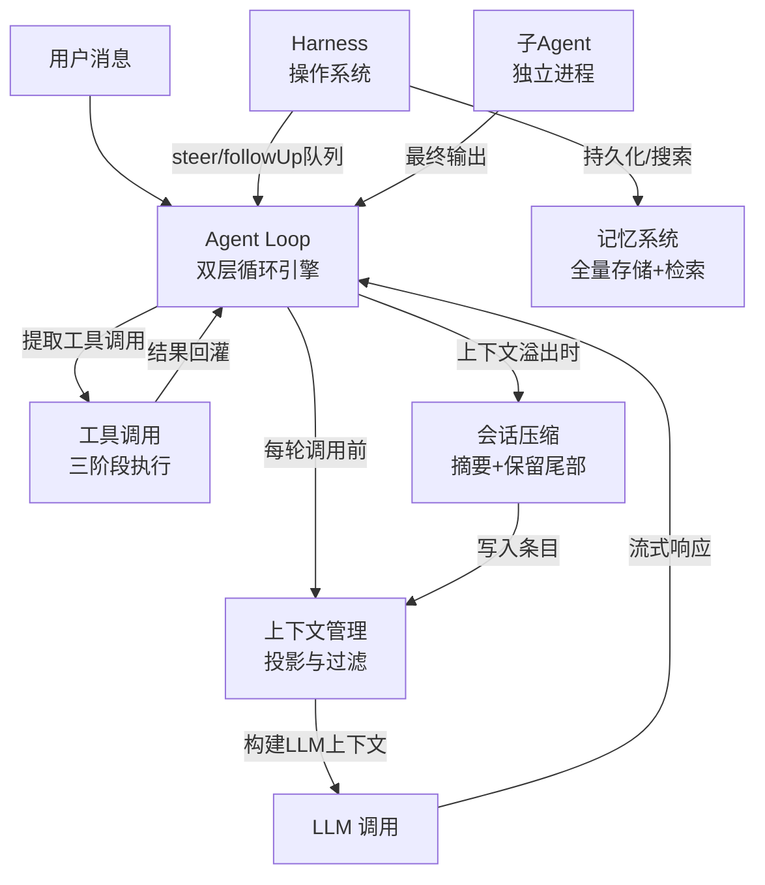
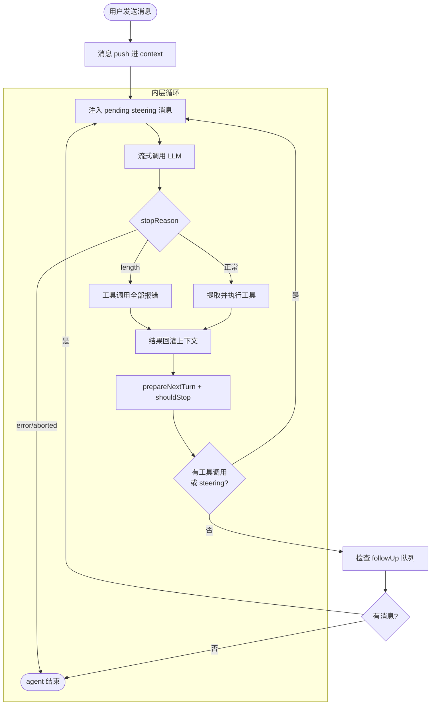
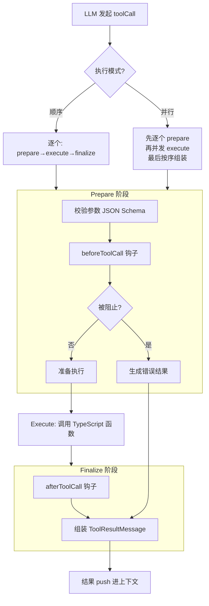
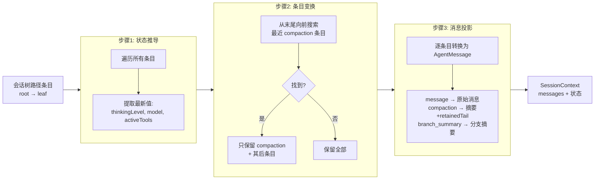
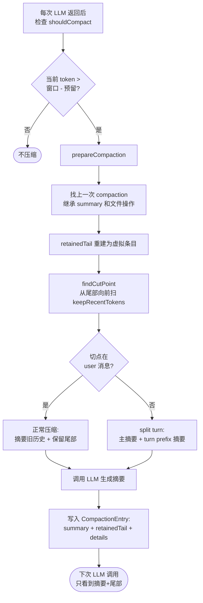

# Pi Agent 核心机制学习笔记

> 本文基于 pi-mono 仓库的实际代码核验，系统梳理 agent 工程的七大核心模块。适合想理解生产级 AI agent 内部机制的工程师阅读。所有结论均来自会话中实际读取的源码，非推测。

## 1. 一句话定位

Pi Agent 是一个可扩展的 agent 基础设施，由七层模块构成：Agent Loop（主循环）、工具调用、上下文管理、会话压缩、Harness（操作系统）、记忆系统和子 Agent。核心包 pi-agent-core 定义契约，pi-coding-agent 提供实现。

## 2. 整体地图

下图回答：七大模块之间的数据如何流动？用户消息从哪里进入，经过哪些处理，最终如何返回？



图未表达 Harness 的 Hook 系统和挂起恢复机制，这些在后文单列。

## 3. Agent Loop — 双层循环引擎

### 3.1 定位

Agent Loop 是整个 agent 的主驱动循环。它决定"模型什么时候被调用、工具什么时候被执行、什么时候停下来等用户说话"。没有它，agent 就只是一次性问答。

### 3.2 输入与输出

- **输入**：用户消息（文本或图片）、当前上下文（历史消息 + 系统提示 + 工具定义）、配置（模型、顺序/并行执行工具、各种钩子）
- **输出**：一组新消息（用户消息 + assistant 消息 + 工具结果消息），通过函数返回值和 agent_end 事件双重交付

### 3.3 何时触发

用户按下回车发送消息的那一刻，runAgentLoop 启动。它不会停在一次 LLM 调用上，而是持续运转直到模型不再发起工具调用、也没有待处理的消息。

### 3.4 消息如何进入上下文

三种消息的写入时机各不相同：

- **用户消息**：在进入主循环之前就 push 进 context.messages。主循环启动时上下文里已经有了用户消息。
- **assistant 消息**：随流式事件实时写入。LLM 开始输出时 push 一条 partial（半成品）消息；后续每个 token 更新都原地修改这条消息；输出结束时用最终消息原地替换 partial。不存在一个独立的"注入"步骤。
- **工具结果消息**：工具执行完毕后直接 push 进 context.messages，不经过任何队列。

### 3.5 执行逻辑

下图回答：Agent Loop 的双层循环如何运转？消息在什么时机注入？什么条件下退出？



**内层循环**（每一轮）：

1. 检查 pendingMessages（steering 消息）。有则注入到 context.messages，清空 pending
2. 流式调用 LLM（streamAssistantResponse），assistant 消息随流式事件实时写入上下文
3. 检查 stopReason：error/aborted → 整个 agent 结束；length → 工具调用全部报错；正常 → 提取 toolCalls
4. 执行工具调用（顺序或并行），结果直接 push 进 context.messages
5. prepareNextTurn 钩子（可中途换模型/思考级别）
6. shouldStopAfterTurn 钩子（外部可强制终止）
7. 再次检查 getSteeringMessages()，有新消息则填入 pending，继续内层循环

**外层循环**：内层彻底停下后（无工具调用、无 pending 消息），检查 getFollowUpMessages() 队列。有 → 设为 pending，重新进入内层；无 → agent 停止。

### 3.6 截断处理

当 LLM 自己的输出被 token 上限截断时（stopReason === "length"），消息中可能包含工具调用，但参数 JSON 可能不完整。此时：

1. **不执行**这些工具调用
2. 为每个工具调用单独生成一条错误结果："Tool call was not executed: the response hit the output token limit, so its arguments may be truncated."
3. 每个错误结果都会 emit 完整的事件流（tool_execution_start → end → result_message），和正常执行一致
4. 下一轮 LLM 调用时，模型看到工具调用失败了，重新发起完整的调用

这不是压缩上下文，而是让模型知道"你上次的调用没成功，请重来"。

### 3.7 两个队列的区别

两个队列都装用户消息，但时机和用途不同：

| | steering 队列 | follow-up 队列 |
|---|---|---|
| **时机** | agent 正在执行时用户输入 | agent 即将停止时用户输入 |
| **注入位置** | 内层循环每一轮开头 | 外层循环检查到内层停了之后 |
| **用途** | 中途纠偏 | 追加任务 |
| **场景** | agent 正在改文件 A，用户说"别改 A 了" | agent 做完了任务，用户在期间又输入了新任务 |

分流由 Harness 层决定，Agent Loop 只消费不分流。

### 3.8 具体例子

```text
用户发送"找到 auth 模块的 token 验证逻辑，加过期检查"

进入 runAgentLoop:
  用户消息 push 进 context.messages  ← 在进入循环前完成

内层第1轮:
  pending → 空 → 调用 LLM → "我来搜索" + grep 工具调用
  执行 grep → 结果 push 进上下文
  检查 steering → 空 → 有工具调用 → 继续内层

内层第2轮:
  pending → 空 → 调用 LLM → 发起 read 工具调用
  执行 read → 结果 push 进上下文
  检查 steering → 空 → 有工具调用 → 继续内层

  // 此时用户输入"等等，先只看不改"
  // 这条消息进入 steering 队列

内层第3轮:
  pending → 有！"等等，先只看不改" → 注入到 context
  调用 LLM → 看到用户新指示 → "好的，只展示" → 无工具调用
  hasMoreToolCalls = false
  检查 steering → 空 → 内层结束

外层:
  检查 followUp → 空 → agent 停止
```

## 4. 工具调用 — agent 的手脚

### 4.1 定位

工具调用是 agent 与外部世界交互的唯一通道。没有工具，agent 只能说话不能做事。

### 4.2 工具实现方式

pi 的内置工具是**原生 TypeScript 函数**，跑在 agent 同一个进程里，不走 MCP 协议，不走 JSON-RPC 通信。

| 工具 | 实现方式 |
|---|---|
| bash | child_process.spawn 启动子进程执行 shell 命令 |
| read | fs.readFile 读文件 |
| write | fs.writeFile 写文件 |
| edit | 读文件 → 字符串匹配替换 → 写回 |
| find / grep / ls | spawn fd / rg 或 Node.js 原生 fs |

扩展工具通过 extension 系统加载，也是 TypeScript 模块直接 import。pi 目前没有原生 MCP 支持。

### 4.3 输入与输出

- **输入**：LLM 在 assistant 消息中发起的工具调用（工具名 + JSON 参数）
- **输出**：工具结果消息（文本或图片内容 + 是否出错 + 可选的 usage 统计）

### 4.4 何时触发

LLM 每次回复时，如果消息中包含 toolCall 类型的内容块，Agent Loop 就会提取这些块并执行。

### 4.5 执行逻辑

下图回答：工具调用从 LLM 发起到结果回灌，经过哪些阶段？顺序和并行模式如何选择？



**两种执行模式**：

- **顺序模式**：每个工具调用依次执行 prepare → execute → finalize。一个完成后才启动下一个。适用于有依赖关系的场景，或工具自身声明了 sequential。
- **并行模式**：先逐个 prepare 所有工具调用，然后并发执行。tool_execution_end 事件按完成顺序发出，但最终的 ToolResultMessage 按模型源消息中的顺序组装。

**模式选择**：如果全局配置为 sequential，或该批工具调用中任何一个工具声明了 executionMode: "sequential"，则走顺序路径。否则走并行路径。

**三个阶段全部在 agent 进程内完成**：

1. **Prepare**：用工具的 JSON Schema 校验 LLM 发来的参数。然后执行 beforeToolCall 钩子，可以阻止执行（返回 { block: true, reason }）
2. **Execute**：直接调用工具的 TypeScript 执行函数。没有网络通信，没有 JSON-RPC，就是函数调用
3. **Finalize**：执行 afterToolCall 钩子，可以覆盖结果。然后组装 ToolResultMessage，格式已经是 LLM 可理解的，不需要额外转换

### 4.6 和 MCP 的对比

| | MCP | pi 内置工具 |
|---|---|---|
| 参数校验 | MCP Client 做 | Agent Loop 做 |
| 执行 | MCP Server 做（跨进程/网络） | 同进程 TypeScript 函数 |
| 结果格式化 | MCP Client 做 | Agent Loop 做 |
| 通信方式 | JSON-RPC over stdio/SSE | 函数调用（无网络） |

结构上相似（都是"调用前校验 + 执行 + 调用后处理"），但执行方式不同。pi 的三步都在同一个进程里，没有客户端-服务器的拆分。

### 4.7 输出截断

工具输出有双重限制：最多 2000 行、最大 50KB，先到者为准。

**"不返回半行"**的含义：逐行累加输出内容，如果加入下一行会超过字节上限，就停止累加，整行丢弃，不把那行的一部分塞进去。

假设文件第 2 行是 500 字符的超长行，字节上限是 100 字节，第 1 行 + 第 2 行加起来超过 100 字节：

- **错误做法（返回半行）**：function hello() { + console.log("这是一个非常非常非 ← 第 2 行被切断
- **pi 的做法**：function hello() { ← 第 2 行整行丢弃，每行都是完整的

这防止模型看到不完整的代码片段产生误解。

### 4.8 具体例子

```text
LLM 同时发起两个工具调用：grep "token" in src/auth/ 和 read src/config.ts

并行模式:
  Prepare grep: 参数 { pattern: "token", path: "src/auth/" } → 符合 Schema → 有效
  Prepare read:  参数 { file_path: "src/config.ts" } → 符合 Schema → 有效
  beforeToolCall 钩子: 无阻止

  并发执行 (同进程函数调用):
    grep: spawn rg 进程 → 返回 3 个匹配行
    read:  fs.readFile → 返回文件内容

  afterToolCall 钩子: 无覆盖

  按源顺序组装 ToolResultMessage:
    结果 1 (grep): "src/auth/token.ts:15: function verifyToken..."
    结果 2 (read): "import { config } from..."
```

## 5. 上下文管理 — 投影与过滤

### 5.1 定位

上下文管理决定"LLM 调用时，到底看到哪些消息"。它不是把所有历史原样发给 LLM，而是经过投影和过滤后的精简版本。

### 5.2 输入与输出

- **输入**：会话树中从 root 到当前 leaf 的所有条目（Entry 列表）——完整不可变日志
- **输出**：SessionContext——派生视图，包含 messages（发给 LLM 的消息列表）、thinkingLevel、model、activeToolNames

### 5.3 何时触发

每次 Agent Loop 准备调用 LLM 之前。Agent Loop 不会直接把内存中的消息列表发给 LLM，而是先通过上下文管理构建出"应该发给 LLM 的消息列表"。

### 5.4 执行逻辑

下图回答：会话树路径条目经过哪三步变换，最终成为 LLM 可见的消息列表？



**三步流水线**：

1. **状态推导**（deriveSessionContextState）：遍历路径上所有条目，提取三类状态的**最后一次生效值**——思考级别、模型（provider + modelId）、激活工具列表。这些不进入 LLM 上下文，但决定 LLM 调用的参数。

2. **条目变换**（defaultContextEntryTransform）：从路径**末尾向前**搜索最近一次 compaction 条目。找到后，只保留 [compaction 条目, compaction 之后的所有条目]。compaction 之前的历史被丢弃——它们已经被摘要替代。如果路径上有多次 compaction，只有最后一次生效。

3. **消息投影**（sessionEntryToContextMessages）：把保留的条目逐个转换为 AgentMessage。

### 5.5 消息投影映射表

| Entry 类型 | 投影为 | 说明 |
|---|---|---|
| message (user/assistant/toolResult) | 原始消息 | deferred 状态的 assistant 消息跳过 |
| message (bashExecution) | user 消息 | convertToLlm 时转为 role: "user" + 格式化文本 |
| message (custom) | user 消息 | 通过 entryProjectors 自定义投影 |
| compaction | compactionSummary 消息 | convertToLlm 时包在 summary 标签里，role 为 user |
| branch_summary | branchSummary 消息 | convertToLlm 时包在 summary 标签里，role 为 user |
| model_change / thinking_level_change / active_tools_change | 空 | 只影响状态推导，不产生消息 |

关键细节：compactionSummary 和 branchSummary 消息在 convertToLlm 时都被包装为 role: "user" 消息，内容用 XML 标签包裹。对 LLM 来说，这些看起来像是用户发的一段说明文字。

### 5.6 具体例子

假设会话树路径上有 20 个条目，其中第 8 个是 compaction 条目：

```text
变换前路径:
  [msg1, msg2, ..., msg7, compaction@8, msg9, ..., msg20]

步骤2变换后:
  [compaction@8, msg9, msg10, ..., msg20]

步骤3投影为 LLM 消息:
  [摘要消息("之前讨论了X、Y、Z"),
   msg9, msg10, ..., msg20]
```

LLM 看到的不是 20 条原始消息，而是 1 条摘要 + 12 条近期消息。这把上下文从可能 50K token 压缩到了 15K token。

## 6. 会话压缩 — 上下文窗口守门员

### 6.1 定位

Compaction 解决一个硬约束：LLM 的上下文窗口是有限的。当对话越来越长，上下文会逼近窗口上限。Compaction 在溢出前把旧历史压缩成摘要，腾出空间。

### 6.2 何时触发

每次 LLM 调用返回后，检查当前上下文 token 数是否超过 contextWindow - reserveTokens（默认预留 16384）。超过则触发压缩。

### 6.3 Token 估算策略

采用"provider 报告优先 + 估算兜底"的双层策略：

- calculateContextTokens(usage) = usage.totalTokens || (usage.input + usage.output + usage.cacheRead + usage.cacheWrite)
- 优先使用最近一次有效 assistant 消息的 usage（精确计数），跳过 aborted/error 和零 totalTokens 的消息
- 对于 usage 之后追加的消息，用字符数 / 4 的保守启发式估算
- 图片固定按 4800 字符估算
- 最终 token 数 = usageTokens + trailingTokens

**usage 是单次请求计数，不是会话累计**。因为每轮把整个历史重发给 LLM，最近一次 usage ≈ 当前上下文真实大小。

### 6.4 压缩执行流程

下图回答：从检测到上下文溢出，到写入 compaction 条目，经过哪些步骤？切点如何选择？split turn 如何处理？



### 6.5 切点选择算法

1. **找合法切点**：user、assistant、bashExecution、custom、branchSummary、compactionSummary、branch_summary 是合法切点。**toolResult 不是合法切点**——toolCall 和 toolResult 必须成对保留。

2. **从尾部向前累加 token**：当累加值 >= keepRecentTokens（默认 20000）时，在合法切点列表中找到第一个 >= 当前位置的切点。

3. **判断 split turn**：切点落在 user 消息上 → 不是 split turn；落在非 user 消息上 → 向前找 turn 起点（user 消息或 branch_summary）。

### 6.6 CompactionEntry 结构

```typescript
interface CompactionEntry {
  type: "compaction";
  summary: string;               // 摘要文本
  retainedTail: AgentMessage[];  // 保留的近期消息，内联存储
  tokensBefore: number;          // 压缩前估算 token 数
  details?: unknown;             // 文件操作记录 { readFiles, modifiedFiles }
  usage?: Usage;                 // 摘要 LLM 调用的 usage
}
```

**retainedTail 是直接内联存储的 AgentMessage[]，不是指向树节点的指针。** 会话树 append-only，旧消息一个不删。真正的"压缩"发生在上下文投影时。

### 6.7 Prompt 模板

| 模板 | 用途 | 格式 |
|---|---|---|
| SUMMARIZATION_PROMPT | 首次摘要 | Goal / Constraints / Progress / Key Decisions / Next Steps / Critical Context |
| UPDATE_SUMMARIZATION_PROMPT | 增量更新 | PRESERVE 已有 + ADD 新信息 + UPDATE Progress |
| TURN_PREFIX_SUMMARIZATION_PROMPT | split turn 前半段 | Original Request / Early Progress / Context for Suffix |

摘要请求设置 cacheRetention: "none" 和新 sessionId，不写缓存、不进会话历史。主摘要 maxTokens = min(0.8 * reserveTokens, model.maxTokens)；turn prefix 摘要 = min(0.5 * reserveTokens, model.maxTokens)。

### 6.8 文件操作累积

每次压缩都从上一次 compaction 条目的 details 中继承文件操作记录（readFiles、modifiedFiles），再叠加本次压缩区间内的新操作。文件列表是跨多次压缩累积的，模型始终能看到整个会话读过/改过哪些文件。

### 6.9 具体例子

```text
用户和 agent 聊了 35 轮，上下文达到 190K token，窗口 200K:

触发判断: 190K > 200K - 16K = 184K? → 是

prepareCompaction:
  找到上一次 compaction（第 8 轮）→ 继承 summary 和文件操作
  retainedTail 重建为虚拟条目
  findCutPoint: 从尾部向前扫，累计到 20K token → 切点在第 30 轮
  切点在 user 消息上 → 不是 split turn

compact:
  摘要第 1~30 轮 → 调用 LLM 生成摘要
  保留第 31~35 轮作为 retainedTail
  文件操作: readFiles=[token.ts, config.ts], modifiedFiles=[token.ts]

写入 CompactionEntry:
  summary: "用户要求添加 token 过期检查..."
  retainedTail: [msg31, msg32, ..., msg35]
  details: { readFiles: [...], modifiedFiles: [...] }

下次 LLM 调用:
  上下文管理看到 compaction 条目 → 只发送 [摘要 + retainedTail]
  上下文从 190K 降到 ~25K
```

## 7. Harness — agent 的操作系统

### 7.1 定位

Harness 是 Agent Loop 的上层容器。Agent Loop 只管"一轮怎么跑"，Harness 管"多轮怎么编排、怎么暂停恢复、怎么导航历史、怎么排队消息"。它是 agent 的操作系统。

分层关系：pi-agent-core 的 AgentHarness 定义契约（基类方法默认抛 HarnessNotImplemented），pi-coding-agent 的 AgentSession 通过组合 Agent 类提供实现。核心包定义"应该能做什么"，上层定义"具体怎么做"。

### 7.2 Lane — 对话流

Lane 是一条独立的对话流。pi 当前只有一条 Lane（名为 "main"），但接口设计支持多 Lane 并行——每条 Lane 有自己的 leafId（当前对话位置）、操作状态、队列。

Lane 暴露的方法不是抽象概念，每个都对应具体行为：

| 方法 | 做什么 | 输入 | 输出 |
|---|---|---|---|
| prompt(text) | 发送消息启动一轮运行 | 文本或消息对象 | RunResult（completed/aborted/failed/suspended） |
| skill(name) | 调用预定义技能 | 技能名 + 额外指令 | RunResult |
| compact() | 触发上下文压缩 | 可选自定义指令 | CompactionResult |
| navigateTree(targetId) | 导航到会话树的其他节点 | 目标节点 ID | NavigationResult |
| steer(text) | 向 steer 队列添加消息 | 文本 | QueueResult（entryId） |
| followUp(text) | 向 followUp 队列添加消息 | 文本 | QueueResult |
| abort() | 中止当前操作 | 无 | AbortResult（返回 steer 和 followUp 队列内容） |
| resume() | 恢复挂起的操作 | 无 | ResumeResult |

关键约束：Agent 类的 prompt() 在 this.activeRun 存在时直接 throw "Agent is already processing"。这意味着不能同时启动两个 prompt——运行中的消息必须走 steer 或 followUp 队列。

### 7.3 三种操作类型及生命周期

Harness 管理三种操作，每种都有完整的生命周期记录（通过 LaneRecord 持久化到会话树）。

#### Run 操作

做什么：启动 Agent Loop 处理用户消息。

输入：用户消息（文本/图片/消息对象）

输出：RunOutcome，四种可能：

| 状态 | 含义 | 何时出现 |
|---|---|---|
| completed | 正常完成 | 模型不再发起工具调用，也没有待处理消息 |
| aborted | 被用户中止 | 用户按了 Ctrl+C，或调用了 abort() |
| failed | 运行失败 | LLM 返回 error 且不可重试，或工具执行抛出未捕获异常 |
| suspended | 被挂起 | 遇到 deferred tool（异步等待外部资源），或进程崩溃 |

生命周期记录：

```text
Run 启动:
  写入 OperationStartedRecord { intent: { kind: "run", originalPrompt, initialMessages } }

Run 运行中:
  每轮 assistant 响应 → 写入 StepAttemptRecord { step: "assistant", attempt: 1 }
  每次工具执行 → 写入 ToolStartedRecord { toolName, effectiveArgs }
  每次队列操作 → 写入 QueueEnqueuedRecord { queue: "steer" | "followUp" }

Run 完成:
  写入 OperationFinishedRecord { outcome: "completed" }
  → RunResult = { runId, kind: "completed", leafId, finalEntryId, finalMessage }
```

#### Compaction 操作

做什么：压缩上下文，把旧历史变成摘要。

输入：可选的自定义指令（比如"重点保留 auth 相关的文件路径"）

输出：CompactionOutcome，四种可能：

| 状态 | 含义 |
|---|---|
| completed | 压缩成功，生成了 CompactionEntry |
| declined | 拒绝压缩（上下文不够长，或没有可压缩的内容） |
| aborted | 被用户中止 |
| failed | 摘要 LLM 调用失败 |

真实场景：对话进行到第 35 轮，上下文 190K token，窗口 200K。agent_end 事件后，AgentSession 检查 shouldCompact(190K, 200K, { reserveTokens: 16384 }) → true → 自动启动 compaction 操作。

#### Navigation 操作

做什么：导航到会话树的其他节点（回溯到历史某个点，或切换到另一个分支）。

输入：目标节点 ID + 可选参数（是否生成分支摘要、自定义指令、标签）

输出：NavigationOutcome，四种可能：

| 状态 | 含义 |
|---|---|
| completed | 导航成功，可能生成了 BranchSummaryEntry |
| declined | 拒绝导航（目标节点不存在或无效） |
| aborted | 被用户中止 |
| failed | 分支摘要生成失败 |

真实场景：用户在会话树 UI 中点击第 10 轮的节点，想回到那个时间点尝试另一种方案。navigateTree("entry-10-id", { summarize: true }) → 收集当前分支（第 11~35 轮）的条目 → 生成分支摘要 → 写入 BranchSummaryEntry 到目标分支 → 上下文管理重建：只包含 entry-10 之前的条目 + branch_summary。

### 7.4 三个消息队列

三个队列都装 AgentMessage，但注入时机和用途不同。队列实现在 PendingMessageQueue 类中，有 mode: QueueMode（"all" 或 "one-at-a-time"）控制 drain 行为。

#### steer 队列

做什么：在 Agent Loop 内层循环每一轮开头注入的消息。用于"中途纠偏"。

具体实现：Agent.steer(message) → steeringQueue.enqueue(message)。Agent Loop 每轮开头调用 getSteeringMessages() → 实际调用 steeringQueue.drain()。drain 行为：mode="all" → 返回全部并清空；mode="one-at-a-time" → 只返回最老的一条。

真实场景：

```text
agent 正在第 3 轮执行 read 工具读取 token.ts

用户输入"等等，先只看不改"
→ AgentSession.prompt("等等...", { streamingBehavior: "steer" })
→ _queueSteer: _steeringMessages.push("等等...")  // UI 显示用
  → agent.steer({ role: "user", content: [...] })
  → steeringQueue.enqueue(message)
  → emit queue_update → UI 显示"1 pending steering"

Agent Loop 第 4 轮开头:
  → getSteeringMessages() → steeringQueue.drain() → ["等等..."]
  → 注入到 context.messages
  → _handleAgentEvent 收到 message_start(user) → 从 _steeringMessages 移除
  → emit queue_update → UI 显示"0 pending steering"
  → LLM 看到这条消息 → 调整策略
```

#### followUp 队列

做什么：在 Agent Loop 外层循环（内层彻底停了之后）检查的消息。用于"追加任务"。

具体实现：Agent.followUp(message) → followUpQueue.enqueue(message)。Agent Loop 外层调用 getFollowUpMessages() → followUpQueue.drain()。

与 steer 的区别：steer 是"当前运行的纠偏"（同一个 Run 操作内），followUp 是"当前运行快停了，追加一个新任务"（同一个 Run 操作内但触发外层循环继续）。nextRun 是"排队等下一轮独立运行"（新的 Run 操作）。

#### QueueMode 的实际效果

```text
steeringMode = "one-at-a-time"（默认）:
  用户快速输入 3 条 steering: ["别改 A", "改 B", "也改 C"]
  第 4 轮开头 drain → 只返回 ["别改 A"]
  第 5 轮开头 drain → 返回 ["改 B"]
  第 6 轮开头 drain → 返回 ["也改 C"]
  → 每轮只看到一条新消息，模型可以逐条处理

steeringMode = "all":
  同样 3 条消息
  第 4 轮开头 drain → 返回全部 3 条
  → 模型一次看到全部，可以统一处理
```

### 7.5 Hook 系统

11 个钩子点，允许外部代码在 agent 运行的特定时机插入逻辑。以下逐个讲解最关键的几个：

#### before_run

触发时机：Lane.prompt() 被调用后，Agent Loop 启动前。

能做什么：注入额外的初始消息（比如自动加载项目上下文文件的内容）。

真实场景：用户输入"加过期检查" → before_run 钩子触发 → 扩展注入"项目使用 JWT 认证，token 存在 src/auth/token.ts" → 这条消息和用户消息一起进入上下文 → LLM 第一轮就看到项目上下文，不用先 grep 找。

#### transform_context

触发时机：每次 LLM 调用前，构建上下文之后。

能做什么：修改发给 LLM 的消息列表（比如过滤掉敏感信息、注入动态上下文）。

输入：当前 AgentMessage[]。输出：修改后的 AgentMessage[]。

真实场景：第 3 轮 LLM 调用前，上下文管理构建出 messages = [摘要, msg1, msg2, toolResult1] → transform_context 钩子触发 → 扩展检查 messages，发现 toolResult1 包含 API 密钥 → 用 "***REDACTED***" 替换 → LLM 看到的是脱敏后的内容。

#### before_tool / after_tool

触发时机：工具执行前/后。

before_tool 能做什么：阻止工具执行（返回 { block: true, reason }）。

after_tool 能做什么：覆盖工具结果（返回 { content, isError }）。

真实场景：

```text
LLM 发起 edit 工具调用: edit(file_path="src/auth/token.ts", ...)

→ before_tool 钩子触发
→ 扩展检查: "今天周五，不允许修改 auth 目录的文件"
→ 返回 { block: true, reason: "auth 目录在周五受保护" }
→ 工具不执行
→ 生成错误结果: "Tool call 'edit' was blocked: auth 目录在周五受保护"
→ LLM 看到错误 → 解释原因或换一种方式
```

AgentSession 的实现：beforeToolCall 委托给 ExtensionRunner.emitToolCall，afterToolCall 委托给 ExtensionRunner.emitToolResult。扩展注册 handler 后即可拦截。

#### before_compaction

触发时机：压缩开始前。

能做什么：修改压缩参数（比如注入自定义指令"重点保留 auth 相关的文件路径"）。

#### 完整列表

before_run, before_resume, before_run_end, transform_context, before_request, before_payload, after_response, before_tool, after_tool, before_compaction, before_navigation。

### 7.6 挂起操作

操作可以因为两种原因挂起：crash（进程崩溃）和 deferred（异步等待外部资源）。

#### crash 恢复

场景：agent 正在执行第 5 轮工具调用，进程突然崩溃（OOM、断电等）。

```text
崩溃前:
  OperationStartedRecord 已写入会话树
  StepAttemptRecord { step: "assistant", attempt: 1 } 已写入
  ToolStartedRecord { toolName: "edit" } 已写入
  ← 崩溃，没有写入 OperationFinishedRecord

进程重启:
  → AgentHarness.create() 检查 findRecords({ limit: 1 })
  → 发现 OperationStartedRecord 没有对应的 OperationFinishedRecord → 挂起操作
  → 返回 { harness, suspended: [{ lane: "main", kind: "run", reason: "crash" }] }
  → 调用 resume() → 从崩溃点恢复
```

#### deferred

场景：LLM 发起了一个工具调用，但这个工具需要异步等待外部资源（比如等待用户确认、等待 CI 构建完成）。

```text
LLM 发起工具调用 → 工具返回 DeferredHandle（不是最终结果）
→ Run 操作挂起: { kind: "suspended", deferred: DeferredHandle }
→ 写入 WriteDeferredRecord
→ 外部资源就绪 → 调用 DeferredHandle.resolve(result)
→ resume() → Run 操作恢复 → 工具结果注入上下文 → Agent Loop 继续
```

#### abort 时的队列保存

```text
用户按 Ctrl+C
→ abort() 被调用
→ AbortResult 返回: { steer: [...], followUp: [...] }
  → 当前 steer 和 followUp 队列的内容被带出来
  → 调用方可以选择在新会话中重新入队这些消息
```

### 7.7 Action 追踪

每个原子操作都被记录为 ActionInfo，支持操作重放和审计。

| 类型 | 含义 | 真实场景 |
|---|---|---|
| append_entry | 追加条目到会话树 | 用户消息、assistant 消息、工具结果被持久化 |
| append_record | 追加操作记录 | OperationStarted、ToolStarted 等被持久化 |
| move_lane | 移动 Lane 指针 | 导航到另一个节点 |
| execute_tool | 执行工具 | LLM 发起 bash 调用 |
| stream_assistant | 流式获取 LLM 响应 | 每轮 LLM 调用 |
| hook | 触发钩子 | before_tool 钩子执行 |
| commit_follow_up | 提交 follow-up | followUp 队列被 drain |
| consume_queue_item | 消费队列项 | steering 消息被注入 |
| sleep | 等待 | 重试前的延迟 |

这支持了 drive: "manual" 模式——外部可以逐步驱动 agent 执行，每步只执行一个 Action，用于测试和调试。peekAction() 返回下一个待执行的 Action，executeAction() 执行它。

### 7.8 配置管理

AgentHarness 持有一组可变配置，可以在运行中动态修改：

| 配置 | 方法 | 真实场景 |
|---|---|---|
| model | setModel(model) | 前 5 轮用 Haiku 快速侦察，第 6 轮切 Sonnet 做精细编辑 |
| thinkingLevel | setThinkingLevel("high") | 简单搜索用 "off"，复杂重构用 "high" |
| activeTools | setActiveTools(["read", "grep"]) | 侦察阶段只给读工具，编辑阶段加 edit |
| compaction | setCompactionSettings(settings) | 调整 reserveTokens 或关闭自动压缩 |
| steeringMode | setSteeringMode("all") | 切换为一次注入全部 steering 消息 |

prepareNextTurn 的实际效果：AgentSession 安装了 prepareNextTurnWithContext 钩子，每轮结束后返回一个 snapshot，包含刷新后的 systemPrompt（this._systemPromptOverride ?? this._baseSystemPrompt）和 tools（this.agent.state.tools.slice()）。Agent Loop 用这个 snapshot 替换 currentContext。这意味着：如果用户在第 3 轮期间切换了模型或工具集，第 4 轮 LLM 调用就会用新配置，不需要重启 agent。

### 7.9 完整场景串联

把所有组件串起来，看它们在一次真实使用中如何协作：

```text
用户输入"找到 auth 模块的 token 验证逻辑，加过期检查"

1. Lane.prompt("找到 auth...") 被调用
   → before_run 钩子 → 扩展注入项目上下文
   → 写入 OperationStartedRecord
   → Agent.prompt() → runAgentLoop 启动

2. Agent Loop 内层第 1 轮:
   → getSteeringMessages() → 空
   → transform_context 钩子 → 扩展脱敏
   → stream_assistant → LLM 返回 "我来搜索" + grep 工具调用
   → before_tool 钩子 → 扩展检查 → 允许
   → execute_tool → grep 执行 → 返回 3 个匹配
   → after_tool 钩子 → 扩展增强输出
   → append_entry → 工具结果持久化
   → prepareNextTurnWithContext → 刷新系统提示和工具
   → getSteeringMessages() → 空 → 有工具调用 → 继续内层

3. 用户在 agent 运行时输入"等等，先只看不改"
   → AgentSession.prompt("等等...", { streamingBehavior: "steer" })
   → _queueSteer → steeringQueue.enqueue
   → emit queue_update → UI 显示"1 pending"

4. Agent Loop 内层第 2 轮:
   → getSteeringMessages() → drain → ["等等，先只看不改"]
   → 注入到 context.messages
   → consume_queue_item → 从队列移除
   → emit queue_update → UI 显示"0 pending"
   → LLM 看到"先只看不改" → 回复"好的，只展示" → 无工具调用
   → hasMoreToolCalls = false → getSteeringMessages() → 空 → 内层结束

5. 用户在 agent 运行时输入"然后帮我加个日志"
   → AgentSession.prompt("然后...", { streamingBehavior: "followUp" })
   → _queueFollowUp → followUpQueue.enqueue
   → emit queue_update → UI 显示"1 pending follow-up"

6. Agent Loop 外层:
   → getFollowUpMessages() → drain → ["然后帮我加个日志"]
   → 设为 pending → 重新进入内层

7. Agent Loop 内层第 3 轮:
   → 注入"然后帮我加个日志"
   → LLM 处理 → 发起 edit 工具调用
   → before_tool → 扩展检查 → 允许
   → execute_tool → edit 执行 → 返回修改成功
   → LLM 回复"已添加日志" → 无工具调用
   → 内层结束 → 外层检查 followUp → 空 → agent 停止

8. Lane.prompt() 的 Promise resolve:
   → 写入 OperationFinishedRecord { outcome: "completed" }
   → RunResult = { runId, kind: "completed", leafId, finalEntryId, finalMessage }
```

## 8. 长短记忆 — 全量存储与检索

### 8.1 短期记忆（会话内）

- InMemorySessionStorage 维护会话状态：条目序列、lane 指针、标签、操作记录
- Compaction 是短期记忆的压缩机制——旧历史变摘要，近期消息保留原样
- defaultContextEntryTransform 确保只有最近一次 compaction 之后的历史进入 LLM 上下文

### 8.2 长期记忆（跨会话）

三个机制协作：

1. **JSONL 持久化**：会话以 JSONL 文件形式存到磁盘。每个条目一行 JSON。支持 fork（从某个节点分叉出新会话）。进程重启后可恢复完整会话。

2. **会话搜索**（ScanningSessionSearch）：遍历所有已持久化的会话文件，对每个条目做 JSON.stringify(entry).toLowerCase().includes(text)。没有倒排索引、没有向量编码。score 字段存在但未赋值。

3. **会话树分支**（fork()）：从某个历史节点创建分支。不同分支独立运行、压缩、导航。

### 8.3 关键限制

- 检索是**用户发起的，不是 agent 自发的**。内置工具集没有"搜索历史会话"工具。
- 真正跨会话自动生效的只有 AGENTS.md 类项目文件（启动时自动加载）。
- 搜索是全量扫描，没有语义搜索能力。

## 9. 子 Agent — 任务委派与上下文隔离

### 9.1 定位

子 Agent 允许主 agent 把任务委派给独立的 agent 进程执行。每个子 agent 有自己的上下文窗口、工具集和模型配置，执行完后只把最终结果返回给主 agent。这实现了**上下文隔离**。

### 9.2 三种模式

| 模式 | 参数 | 行为 | 并发控制 |
|---|---|---|---|
| Single | { agent, task } | 一个 agent 执行一个任务 | - |
| Parallel | { tasks: [...] } | 最多 8 个任务，4 个并发 | worker pool 模式 |
| Chain | { chain: [...] } | 顺序执行，{previous} 替换为前一步输出 | - |

### 9.3 Agent 定义

YAML frontmatter + Markdown 格式。frontmatter 声明 name、description、tools、model。从用户级（~/.pi/agent/agents）和项目级（.pi/agents）加载。项目级 agent 需要用户确认。

### 9.4 路由机制

**由主模型通过工具调用自主决定**，代码里无路由算法。模型看各 agent 的 description 决定把哪个名字填进工具调用参数；执行层只做精确名称匹配。

### 9.5 上下文隔离的价值

如果主 agent 自己做侦察，4 轮工具调用全部进入主 agent 上下文，可能消耗 20K+ token。委派给子 agent 后，主 agent 上下文只增加 2K token 的最终发现。这让主 agent 可以在有限的上下文窗口内完成更复杂的任务。

## 10. 速查表

| 目标 | 概念 | 关键条件 |
|---|---|---|
| 理解 agent 如何持续运行 | Agent Loop 双层循环 | 内层靠工具调用和 steering 续命，外层靠 follow-up 续命 |
| 理解 agent 如何做事 | 工具调用三阶段 | Prepare → Execute（同进程函数）→ Finalize |
| 理解 LLM 看到什么 | 上下文管理三步流水线 | 状态推导 → 条目变换 → 消息投影 |
| 理解上下文不溢出 | 会话压缩 | token 超过窗口-预留时触发；摘要旧历史 + 保留尾部 |
| 理解操作编排 | Harness | 三队列 + 11 个 Hook + 挂起恢复 |
| 理解跨会话记忆 | 全量存储 + 关键词检索 | JSONL 持久化 + ScanningSessionSearch 暴力扫描 |
| 理解任务委派 | 子 Agent 独立进程 | 三模式 + 50KB 输出上限 |
| 区别截断和压缩 | 截断 = LLM 输出被切；压缩 = 上下文太长 | 截断时工具调用全部报错让模型重发 |
| 区别 steering 和 follow-up | steering = 中途纠偏；follow-up = 追加任务 | 分流由 Harness 决定 |

## 11. 记忆主线

1. **Agent Loop = 双层循环**：内层靠工具调用和 steering 续命，外层靠 follow-up 续命。用户消息在进入循环前就 push 进上下文，assistant 消息随流式事件实时写入。

2. **上下文 = 日志的投影视图**：存储全量（append-only），看什么由 buildSessionContext 决定。找到最近 compaction 后只保留摘要 + 其后条目。

3. **usage 是单次请求计数**：最近一次 usage ≈ 当前上下文大小。

4. **压缩只换视图不删数据**：CompactionEntry 内联存储 retainedTail。旧消息全保留，投影时跳过。

5. **retainedTail 保最新**：切点由 keepRecentTokens 从尾部反扫。toolResult 不是合法切点。split turn 时 turn 前半段单独摘要。

6. **工具调用三步都在同进程**：Prepare → Execute（TypeScript 函数）→ Finalize。不走 MCP。

7. **长期记忆 = 全量存储 + 关键词检索**：无提炼步骤，无向量库。跨会话常驻记忆只有 AGENTS.md。

8. **子 agent 路由 = 模型看 description 自主点名**：执行层只按名字查表。独立进程，只回最终输出（50KB 上限）。
